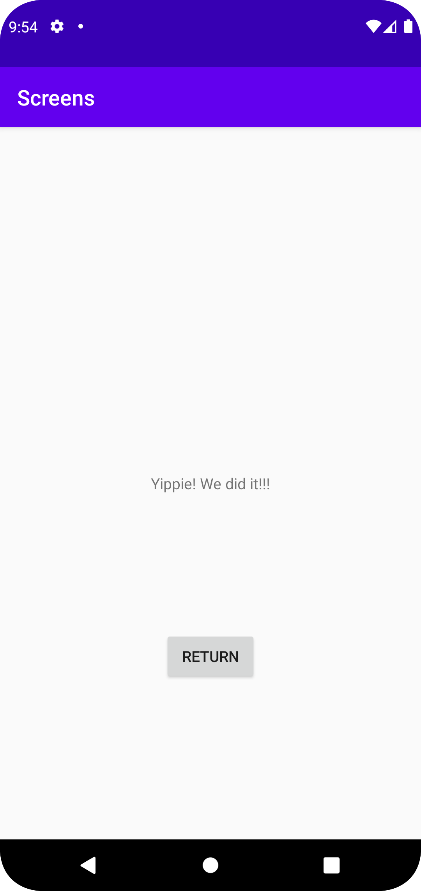

# Rapport

## Adding Activity & Widgets
Först började jag med att skapa en ny, tom, aktivitet till min applikation (activity_second).
Till denna aktivitet skapade jag två stycken widgets, Button och TextView.

```
<TextView
        android:id="@+id/name"
        ...
        app:layout_constraintTop_toTopOf="parent" />

<Button
        android:id="@+id/close_second_activity"
        ...
        app:layout_constraintTop_toTopOf="@+id/name" />
```

## Adding a Button in the first activity that starts the second activity.
För denna delen av uppgiften skapade jag först en knapp widget i (activity_main).
Därefter började jag programmera funktionaliteten hos denna knapp (tillsammans med second_activity).
Väl här började jag med att skapa en variabel som hänvisar till denna knapp, detta gör jag med hjälp av
findViewById. Till detta skapade jag också en setOnClickListener, vilket näst i tur blev att skapa en funktion.
I den nya funktionen skapar jag en Intent som hänvisar till min andra aktivitet som jag nämnde i tidigare steg.
Sedan kallar jag en funktionalitet som heter "startActivity(Intent)", som skickar med min skapta intent med en funktion
som startar själva aktiviteten, när onClick funktionen klickas.

```
public class MainActivity extends AppCompatActivity {

    @Override
    protected void onCreate(Bundle savedInstanceState) {
        super.onCreate(savedInstanceState);
        setContentView(R.layout.activity_main);
        Button button = findViewById(R.id.start_second_activity);
        button.setOnClickListener(new View.OnClickListener() {
            @Override
            public void onClick(View view) {
                Intent intent = new Intent(MainActivity.this, SecondActivity.class);
                intent.putExtra("name", "Yippie! We did it!!!");
                startActivity(intent);
            }
        });
    }
}
```

## Adding data to the Intent using Extras
För uppgiften har jag valt att använda mig utav en textView som tar emot en hårdkodad text när funktionen kallas (knappen klickas),
Därav har jag endast lagt till en putExtra till min skapade Intent. Denna .putExtra skickar med texten "Yippie! We did it!!!"
när onClick funktionen kallas och har namn "ID:t" "name". Väl i andra aktiviteten har jag skapat ett stycke kod som pekar ut den textView
jag skapat i andra aktiviteten, i denna koden har jag ett stycke kod som använder sig utav setText för att sätta värdet av .putExtra
till denna textView. Väl i den andra aktivitetens Java-kod så har jag också en funktion som pekar på knappen som finns i aktivitet två
och avslutar onClick funktionen med en fördefinerad funktion "finish()". Detta resulterar i att aktivitet två stängs 
och man går tillbaka till början, alltså aktivitet ett.

### * Adding extras to my Intent.
```
  public void onClick(View view) {
                Intent intent = new Intent(MainActivity.this, SecondActivity.class);
                intent.putExtra("name", "Yippie! We did it!!!");
                startActivity(intent);
            }
```

### * Sätter text till textView.
```
 protected void onCreate(Bundle savedInstanceState) {
 
     ...
        
     Bundle extras = getIntent().getExtras();
     if (extras != null) {
         String name = extras.getString("name");
         textView.setText(name);
     }

     ...

 }
```

### * Avslutar aktivitet vid knapptryck.
```
 protected void onCreate(Bundle savedInstanceState) {
 
     ...

     Button close = findViewById(R.id.close_second_activity);
     close.setOnClickListener(new View.OnClickListener() {
        @Override
        public void onClick(View view) {
          finish();
        }
     });
 }
```

## Bilder på applikationen
### Aktivitet Ett:

### Aktivitet Två:


## Följande grundsyn gäller dugga-svar:

- Ett kortfattat svar är att föredra. Svar som är längre än en sida text (skärmdumpar och programkod exkluderat) är onödigt långt.
- Svaret skall ha minst en snutt programkod.
- Svaret skall inkludera en kort övergripande förklarande text som redogör för vad respektive snutt programkod gör eller som svarar på annan teorifråga.
- Svaret skall ha minst en skärmdump. Skärmdumpar skall illustrera exekvering av relevant programkod. Eventuell text i skärmdumpar måste vara läsbar.
- I de fall detta efterfrågas, dela upp delar av ditt svar i för- och nackdelar. Dina för- respektive nackdelar skall vara i form av punktlistor med kortare stycken (3-4 meningar).

Programkod ska se ut som exemplet nedan. Koden måste vara korrekt indenterad då den blir lättare att läsa vilket gör det lättare att hitta syntaktiska fel.

```
function errorCallback(error) {
    switch(error.code) {
        case error.PERMISSION_DENIED:
            // Geolocation API stöds inte, gör något
            break;
        case error.POSITION_UNAVAILABLE:
            // Misslyckat positionsanrop, gör något
            break;
        case error.UNKNOWN_ERROR:
            // Okänt fel, gör något
            break;
    }
}
```

Bilder läggs i samma mapp som markdown-filen.


Läs gärna:

- Boulos, M.N.K., Warren, J., Gong, J. & Yue, P. (2010) Web GIS in practice VIII: HTML5 and the canvas element for interactive online mapping. International journal of health geographics 9, 14. Shin, Y. &
- Wunsche, B.C. (2013) A smartphone-based golf simulation exercise game for supporting arthritis patients. 2013 28th International Conference of Image and Vision Computing New Zealand (IVCNZ), IEEE, pp. 459–464.
- Wohlin, C., Runeson, P., Höst, M., Ohlsson, M.C., Regnell, B., Wesslén, A. (2012) Experimentation in Software Engineering, Berlin, Heidelberg: Springer Berlin Heidelberg.
